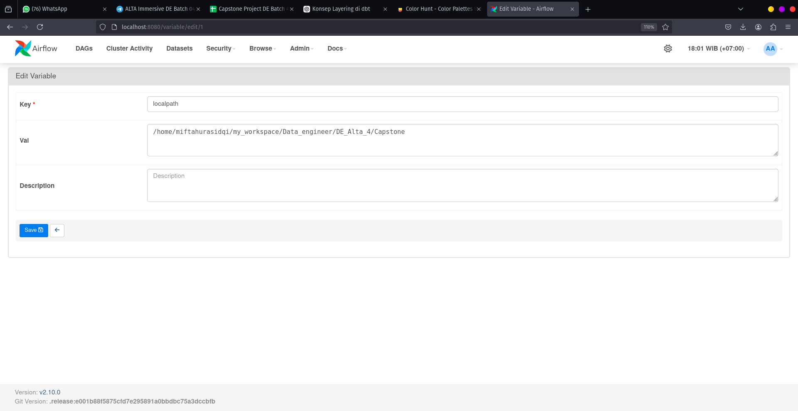
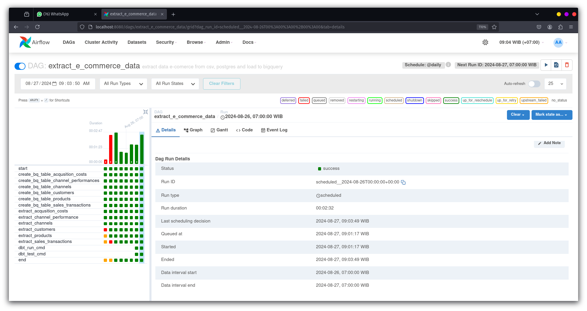

# Green Motion : Data ELT Pipeline Project

## Deskripsi Project

Green Motion Project dibuat untuk mengimplementasikan ELT dengan menggunakan pipeline data untuk mengekstrak, memuat, dan mentransformasi data transaksi penjualan dari sumber data PostgreSQL ke BigQuery. Dengan menggunakan Apache Airflow untuk mengotomatiskan dan menjadwalkan proses ekstraksi dan pemuatan data. Setelah data mentah berada di BigQuery, **dbt (data build tool)** digunakan untuk melakukan transformasi data untuk analisis lebih lanjut.

## Tools

- Postges (Data Source 1)
- CSV (Data Source 2)
- BigQuery (Data Warehouse)
- Python (Ingestion)
- Airflow (Orchestration)
- DBT (Transformation)

## Fitur

- **Ekstraksi Data**: Mengambil data dari basis data PostgreSQL dan CSV menggunakan Airflow (PythonOperator).
- **Pemuatan Data**: Memuat data mentah ke Google BigQuery.
- **Transformasi Data**: Menggunakan dbt untuk transformasi data langsung di BigQuery.
- **Penjadwalan Tugas**: Menggunakan Apache Airflow untuk mengotomatiskan proses ELT.

## Persyaratan

Sebelum memulai, pastikan Anda telah menginstal dan mengkonfigurasi komponen-komponen berikut:

- **Python** >= 3.10
- **Apache Airflow** >= 2.10.0
- **Google Cloud SDK** dengan `google-cloud-bigquery` library
- **PostgreSQL** database
- **dbt** >= 0.20

## Instalasi & Konfigurasi

1. **Clone repositori ini:**

   ```bash
    git clone https://github.com/miftahurasidqi/capstone-DE4_Alta_2.git
    cd e-commerce-data-elt-pipeline
   ```

2. **Buat dan aktifkan virtual environment:**

   ```bash
    python3 -m venv venv
    source venv/bin/activate
   ```

3. **Instal semua dependencies:**

   ```bash
   pip install -r requirements.txt

   ```

4. **Konfigurasi dbt:**

   - setup profiles.yml

   ```bash
   cd dbt_transform/
   mkdir profiles
   touch profiles/profiles.yml
   ```

   ```yml
   dbt_transform:
     outputs:
       dev:
         dataset: ecommers_de4_team_2
         job_execution_timeout_seconds: 300
         job_retries: 1
         keyfile: /path/to/file/bigqueryKey.json
         location: asia-southeast2
         method: service-account
         priority: interactive
         project: alta-de4-capstone-project
         threads: 1
         type: bigquery
     target: dev
   ```

   - install dbt packages

   ```bash
   dbt deps
   ```

5. **Jalankan Airflow:**

   - run docker compose

   ```bash
   docker compose up -d
   ```

   - install library google-cloud-bigquery

   untuk melihat semua container yang sedang berjalan

   ```bash
   docker ps
   ```

   masuk kedalam kontainer airflow

   ```bash
   docker exec -it <container_name_airflow> bash
   ```

   install google-cloud-bigquery

   ```bash
   pip install google-cloud-bigquery
   ```

6. **Konfigurasi koneksi Airflow:**

   - akses airflow di browser

     buka `localhost:8080` untuk mengakses Airflow.

     ```
     Username: airflow
     Password: airflow
     ```

   - setup koneksi ke postgres

     pilih menu `admin > conections`
     

   - setup koneksi ke bigquery

     pilih menu `admin > conections`
     

     pilih menu `admin > variabels`
     

   - jalankan dag

     pilih menu `DAGs > extract_e_commerce_data` dan trigger DAG
     
